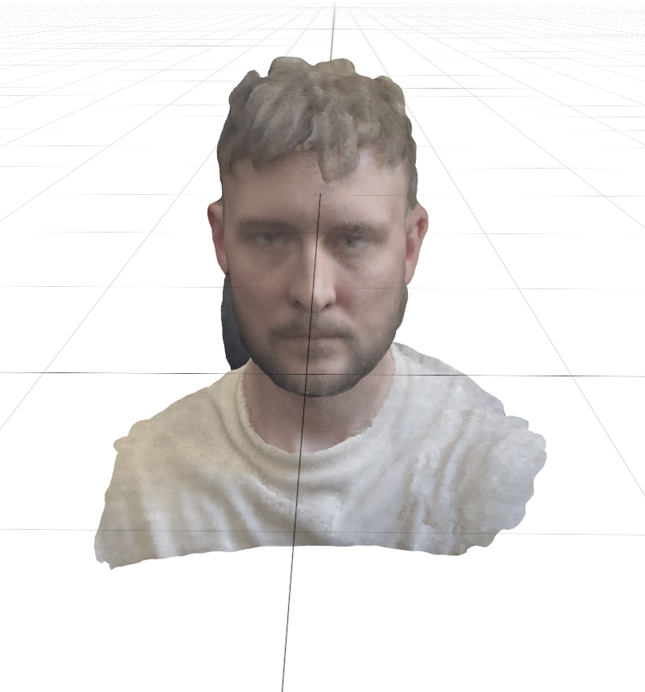
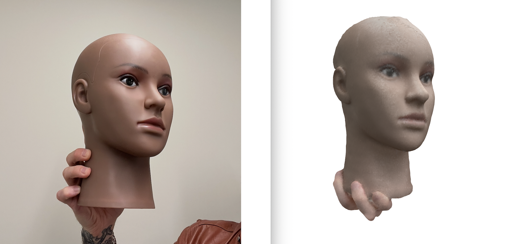

# OVision Reconstruction

## Purpose

OVision Reconstruction is an iOS app that generates 3D point cloud reconstructions of human faces using the iPhone's front-facing TrueDepth camera. The reconstructions are exported as PLY files for use with the **Overlay OvOne** robot, which uses them to drive precise spatial awareness and interaction with human faces. 

Developed by **[Josh Urban Davis](mailto:josh@overlay.com)** for Overlay Robots.




---

## Requirements

- iPhone X or later (any iPhone with a front-facing TrueDepth camera)
- iOS 15+
- For Jetson export: Jetson Nano running the receiver service, connected to the same Wi-Fi network as the iPhone

---

## How to Use the App

### Taking a Scan

1. Open **OVision** on your iPhone.
2. Point the front camera at the subject's face. Use the oval guide to frame and the distance label to position correctly (30–50 cm is ideal).
3. Tap the record button to begin scanning. The camera locks its exposure at the start to prevent color drift.
4. Slowly rotate your viewpoint around the face to capture coverage from multiple angles. The reconstruction updates in real time. The oval fades during scanning — focus on moving slowly and smoothly.
5. If you see **"Move slower — tracking lost"**, slow down and hold steady until tracking recovers.
6. Tap the stop button when done.

### Framing a Scan

Before tapping record, a **dashed oval guide** is shown on screen indicating where to position the face. A **distance label** appears above the oval if the subject is too close or too far:

- **"Move closer"** — subject is more than ~60 cm from the camera
- **"Move back"** — subject is less than ~25 cm from the camera
- No label — distance is good, ready to scan


<!-- Image: distance label examples (Move closer / Move back) -->

Once the face is centered in the oval and no distance warning is shown, tap the shutter button to begin.

### Reviewing and Exporting

7. The completed scan appears in the **Scans** list. Tap it to preview the point cloud.
8. Optionally tap **Mesh** to run Poisson surface reconstruction and generate a triangle mesh from the point cloud.
9. Tap the **Export** button (share icon). You will be prompted: **"What is your name?"** — enter your name or leave blank for the default timestamp filename.
10. Choose an export action:
    - **Send to Jetson** — uploads the PLY directly to the Jetson Nano over HTTP.
    - **Share / Export** — opens the iOS share sheet (AirDrop, Files, etc.).
11. You can also swipe left on any scan in the list to access **Export**, **Jetson**, or **Delete** actions directly.

### Configuring the Jetson Connection

Tap the gear icon (top right of the Scans screen) to open Jetson settings. Enter the IP address and port of your Jetson Nano receiver.

---

## Development History

The following modifications were made on top of the Standard Cyborg SDK to improve reconstruction quality and add Overlay-specific workflows:

### Scan Guidance UI
- **Face oval guide** — A dashed oval overlay on the scanning screen shows where to position the subject's face before recording begins. The oval fades to 30% opacity while scanning to remain visible without being distracting.
- **Distance indicator** — Before scanning begins, the center depth pixel cluster is sampled each frame from the raw TrueDepth depth map. If the subject is outside the optimal 25–60 cm range, a label reads "Move closer" or "Move back". The label hides automatically when the distance is correct and disappears entirely once scanning starts.

### Scan Quality Improvements
- **Exposure lock during scanning** — Auto-exposure is locked at the start of each scan. Previously, fluctuating exposure mid-scan caused color inconsistencies and surface speckling in the PLY output.
- **Bilinear interpolation for depth-to-color mapping** — When projecting depth pixels onto the color image, the original code used nearest-neighbor (integer truncation). We replaced this with bilinear interpolation across the four neighboring color pixels, which reduces aliasing and produces smoother per-point colors.

### Export Workflow
- **Custom filename prompt before export** — Before exporting or sending a PLY file, the app prompts for a name. The name is sanitized (spaces → underscores, non-alphanumeric characters stripped) and prepended to the filename (e.g. `josh-Scan-2026-04-22--14-30-00.ply`). Leaving the field blank uses the default timestamp filename.
- **Timestamp-based default filenames** — Exported files are named with the date and time of export (e.g. `Scan-2026-04-22--14-30-00.ply`, `Mesh-2026-04-22--14-30-00.ply`) so files don't overwrite each other.
- **Jetson Nano HTTP export** — A "Send to Jetson" action uploads the PLY file directly to a configured Jetson Nano over HTTP (local network), enabling a wireless scan-to-robot pipeline without needing a Mac in the loop. The Jetson IP and port are configurable from a settings panel in the app.
- **Removed QuickLook / AR preview on export** — Sharing a scan previously opened a QuickLook AR viewer instead of the standard iOS share sheet. Export now goes directly to `UIActivityViewController` (AirDrop, Files, etc.), and the USDZ/AR code path has been removed entirely.

### Reliability Fixes
- **Crash on launch fix** — The original code used a force-try (`try!`) when reading the scans directory on launch. A corrupted or inaccessible Documents directory would crash the app immediately. This is now a graceful `do-catch` that logs the error and starts with an empty scan list.
- **Surfel data race condition fix** — During live scanning, `buildPointCloud` was handing the UI thread a raw pointer into the surfel buffer without synchronization. If the reconstruction engine reallocated the buffer mid-read, the app could crash or render corrupted geometry. The read is now serialized on the model queue with a proper copy, eliminating the race.
- **Poor tracking warning** — When the reconstruction engine loses tracking (e.g. the phone moves too fast), the app now shows a "Move slower — tracking lost" message on screen after 5 consecutive poor-tracking frames. Previously, tracking loss was silent and the scan would silently degrade in quality.
- **Idle timer fix** — After visiting the scanning view, `isIdleTimerDisabled` was incorrectly left as `true` when leaving the view, preventing the screen from ever auto-dimming or locking until the app was restarted.
- **Metal shader error handling** — Metal GPU pipeline creation previously used force-try (`try!`), which would crash with a generic error if a shader failed to compile. Now uses `do-catch` with descriptive error messages for easier debugging.
- **Delegate race condition fix** — The reconstruction engine called its delegate on the main thread without first retaining it, creating a brief window where a deallocated delegate could be messaged between stopping a scan and the view dismissing. The delegate is now captured as a local strong reference before the call.

---

## App Overview

The reconstruction pipeline runs entirely on-device in real time.

```
┌─────────────────────────────────────────────┐
│              TrueDepth Camera               │
│  Depth map (Float32, up to 640×360 @ 30fps) │
│  Color frame (up to 1920×1080 @ 30fps)      │
└───────────────────┬─────────────────────────┘
                    │ synchronized frames
                    ▼
┌─────────────────────────────────────────────┐
│           Metal GPU Depth Processing        │
│  · Bilateral smoothing of raw depth         │
│  · Per-pixel normal estimation (gradients)  │
│  · Per-pixel weight (angle of incidence)    │
└───────────────────┬─────────────────────────┘
                    │ processed depth + normals
                    ▼
┌─────────────────────────────────────────────┐
│             Surfel Estimation               │
│  Each valid depth pixel → surfel:           │
│  position (xyz), normal, color, weight,     │
│  radius. Color sampled from RGB frame via   │
│  bilinear interpolation.                    │
└───────────────────┬─────────────────────────┘
                    │ new surfel candidates
                    ▼
┌─────────────────────────────────────────────┐
│           ICP Pose Estimation               │
│  Iterative Closest Point aligns new frame   │
│  to existing model to track camera motion.  │
│  (18 iterations, 5% downsampled point set)  │
└───────────────────┬─────────────────────────┘
                    │ camera pose (4×4 matrix)
                    ▼
┌─────────────────────────────────────────────┐
│              Surfel Fusion                  │
│  GPU index map gives O(1) lookup of nearby  │
│  existing surfels. New surfels are merged   │
│  by weighted average (cos²θ weighting).     │
│  Surfels too far from any existing surfel   │
│  are added to the model as new geometry.    │
└───────────────────┬─────────────────────────┘
                    │ global surfel model
                    ▼
         ┌──────────────────────┐
         │   PLY Point Cloud    │  ← exported to Jetson / Files
         └──────────┬───────────┘
                    │ tap Mesh (optional)
                    ▼
┌─────────────────────────────────────────────┐
│       Poisson Surface Reconstruction        │
│  Surfel normals define an indicator         │
│  function solved on an adaptive octree.     │
│  Marching cubes extracts the iso-surface    │
│  as a triangle mesh with vertex colors.     │
└───────────────────┬─────────────────────────┘
                    │
                    ▼
         ┌──────────────────────┐
         │   PLY Triangle Mesh  │  ← exported to Jetson / Files
         └──────────────────────┘
```

---

## Built on Standard Cyborg SDK

This app is built on top of the [Standard Cyborg Cocoa SDK](https://github.com/StandardCyborg/StandardCyborgCocoa), an open-source real-time 3D scanning framework for iOS. The SDK was developed by the team at Standard Cyborg — a company that originally built 3D-printed prosthetics, then open-sourced their scanning framework before closing. We are grateful to the Standard Cyborg authors and contributors for making this available under the MIT license.

Original SDK authors (via git history and documentation):
- **Aaron Thompson**
- **Eric Schkufza**
- **Nigel Morris**
- and contributors at Standard Cyborg, Inc.

This SDK enables real-time 3D scanning on iOS using the TrueDepth camera, plus analysis and other tools for generated scans.


## Installing

Use Swift Package Manager to add these dependencies

 (optional)

The version of StandardCyborgFusion hosted via Cocoapods is now deprecated and unmaintained.

## Feedback, Issues, and Help

Standard Cyborg was once a company that developed 3D-printed prosthetics, then later, this software package for 3D scanning and analysis. The company no longer exists, but in its death, it was able to open-source this 3D scanning and analysis framework under the MIT license.

All feature development, maintenance, and support is provided only by open source maintainers.

## License

This codebase is released under the MIT license

See LICENSE file
